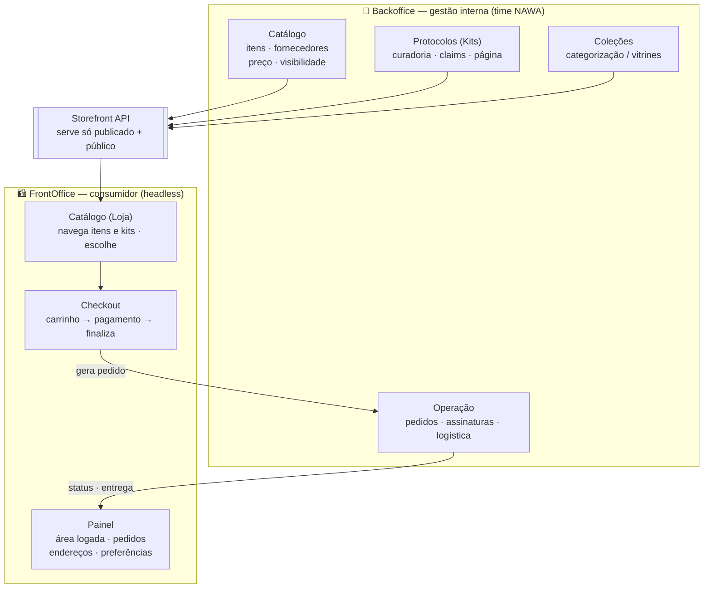
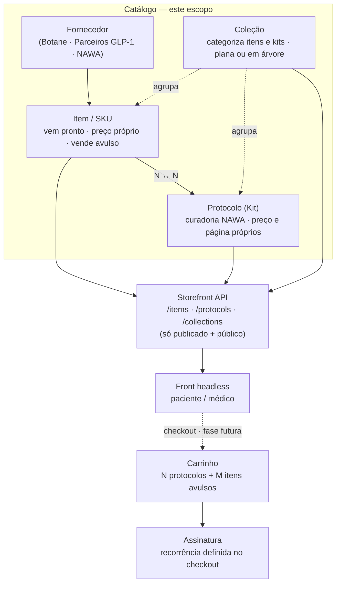

# Catálogo & Protocolos v2 — Documentação Técnica

> Documento de referência para o time. Descreve a arquitetura do catálogo do
> backoffice NAWA na versão 2, as regras de negócio implementadas e o estado da
> entrega. Base técnica completa em `catalogo-protocolos-v2.md`.
>
> **Versão do documento:** 2026-07 · **Status:** Fases 0–4 em produção.

---

## 1. Resumo executivo

A NAWA **não formula** — ela faz **curadoria de produtos prontos** e aplica
inteligência na anamnese para montar a compra. A partir desse entendimento, o
sistema deixou de ser uma "plataforma clínica com loja acoplada" e passou a ser
uma **gestão de e-commerce padrão, com três peculiaridades de saúde**.

Na prática, isso **simplificou** o produto: onde antes havia um catálogo clínico
*e* um catálogo comercial ligados por uma ponte, agora existe **um só catálogo**.
O produto já nasce comercial. A evolução futura (longevidade, hormonal) passa a
ser **cadastro**, não reescrita de código.

---

## 2. Antes → Depois

| Antes (v1) | Depois (v2) | Efeito |
|---|---|---|
| Catálogo clínico + catálogo comercial + ponte | **Um catálogo** de itens | Removeu uma camada inteira |
| `Fórmula` (só Botane) | `Item` / SKU (Botane, parceiros, serviços NAWA) | Cobre todos os casos |
| `Protocolo` como agrupamento clínico | `Protocolo` = **kit** com preço e página próprios | Virou produto comercial |
| `Plano` como catálogo | `Plano` = configuração de checkout (fase futura) | Recorrência sai do catálogo |
| `Jornada` como módulo | Virou **coleção** | Removeu um módulo |
| `Atributos` / nomenclatura | Virou **coleção** | Removeu um módulo |
| Visibilidade acoplada a "é GLP-1?" | Visibilidade explícita: `pública` / `só médico` | Regra clara |

---

## 3. Arquitetura

### 3.1 Visão de produto (macro)

As duas grandes áreas do sistema e seus processos. O **Backoffice** é a fonte da
verdade: gere toda a operação e **publica** na Storefront API. O **FrontOffice** é
headless e **consome** essa API.



- **FrontOffice — Catálogo (Loja):** onde o consumidor acessa, navega pela loja e pelos
  itens/kits e escolhe o que comprar.
- **FrontOffice — Checkout:** o fluxo de finalização — do carrinho ao pagamento até fechar
  a compra (e definir recorrência, quando houver).
- **FrontOffice — Painel:** a área logada do cliente — seus pedidos, endereços, preferências etc.
- **Backoffice:** a gestão interna da NAWA — entrada de itens, cadastro de fornecedores,
  criação de coleções e protocolos, precificação/visibilidade, e a operação (pedidos,
  assinaturas, logística).

> **Estado atual:** o Backoffice de catálogo (Catálogo, Protocolos, Coleções) e a Storefront
> API estão **em produção**. Checkout e Painel são **fases futuras** (o FrontOffice é o front
> headless, construído fora deste backoffice e consumindo a API).

### 3.2 Modelo do catálogo (entidades)



O **Carrinho** e a **Assinatura** pertencem ao **checkout** (fase futura, fora deste
escopo — ver §11). Aparecem no diagrama apenas para mostrar *para onde* o catálogo
flui: o catálogo publica na Storefront API, o front consome, e a compra em si acontece
depois, no checkout.

**Leitura em texto (para quem for gerar o diagrama à parte):**

```
CATÁLOGO (este escopo)

  Fornecedor  →  Item (SKU)  ──N↔N──  Protocolo (Kit)

  Coleção  ─agrupa→  Itens e Kits   (plana ou em árvore)

  Item / Protocolo / Coleção  →  Storefront API  →  Front headless
                                 (só publicado + público)

────────────────────────────────────────────────────────────────

CHECKOUT (fase futura — outra spec)

  Front headless  →  Carrinho (N protocolos + M itens avulsos)  →  Assinatura (recorrência)
```

### Entidades

- **Fornecedor** — a origem do item. Botane é o primeiro, não o único: há parceiros
  de GLP-1 e a própria NAWA como fornecedor interno (serviços).
- **Item (SKU)** — a unidade vendável. Vem pronto do fornecedor, tem preço próprio
  e vende avulso. É o antigo "Fórmula", renomeado.
- **Protocolo (Kit)** — a curadoria da NAWA: um agrupamento de itens com **preço e
  página/descrição próprios**. É a propriedade intelectual da operação.
- **Coleção** — a categorização mercadológica. Agrupa itens e protocolos, plana por
  padrão e em árvore quando precisa. Substitui jornadas e nomenclatura.

---

## 4. As três peculiaridades de saúde

Fora destas três, é e-commerce padrão (produtos, kits, coleções, fornecedores,
preço, margem).

1. **Visibilidade `só médico`.** Todo item e protocolo é `público` ou `só médico`.
   Medicamento é **sempre** `só médico`. Um kit é tão restrito quanto seu item mais
   restrito — se contém algo médico, o kit inteiro fica médico. A vitrine pública
   nunca enxerga o que é médico.

2. **Claims regulatórios.** O texto de saúde que aparece para o paciente só vai ao ar
   depois de **aprovado**. Editar o texto derruba a aprovação. É bloqueio regulatório,
   não metadado.

3. **Fluxo de telemedicina** *(adiado — outra spec).* Alguns protocolos só serão
   vendidos com apoio de teleconsulta. É um fluxo de venda à parte, que entra junto
   com a spec de checkout.

---

## 5. Regras de negócio implementadas

**Preço do kit é dele.**
- Um kit nasce com o preço da **soma** dos itens (origem `soma`).
- Depois, o preço **nunca recalcula sozinho** — nem quando o preço de um item muda,
  nem quando um item entra ou sai. Kit tem desconto: o preço normalmente não é a soma.
- O sistema **mostra a divergência** ("deriva") quando o preço foge da soma atual,
  mas **nunca corrige sozinho**. Quando a origem é `soma`, oferece recalcular em um
  clique; quando é `manual`, não oferece (alguém definiu aquele número de propósito).

**Fornecedor é dono do dado dele.**
- Composição, dose, forma e custo vêm do fornecedor e ficam **somente leitura** no
  backoffice (para fornecedor externo). A NAWA é dona de **preço, visibilidade e
  curadoria**. Serviços internos da NAWA são editáveis normalmente.

**Falha fechada.**
- Na dúvida, o item nasce `só médico`. É melhor um produto sumir da vitrine e alguém
  reclamar do que um produto médico vazar. A regra de "nunca vazar `só médico`" é
  aplicada tanto na escrita quanto **no momento de servir a Storefront** (dupla
  checagem), inclusive dentro do rollup de uma coleção pública.

**Preço obrigatório para publicar.** Item ou protocolo só publica com preço definido.

---

## 6. Modelo de dados (resumo)

| Entidade | Papel |
|---|---|
| `suppliers` | Fornecedores (farmácia, parceiro, interno) |
| `items` | Itens/SKUs — o catálogo único (renomeado de `formulas`) |
| `protocols` | Kits — preço, página, claims, visibilidade, versão |
| `protocol_items` | Vínculo N↔N item ↔ kit, com quantidade |
| `protocol_versions` | Histórico de versões do protocolo |
| `collections` | Coleções (plana ou árvore via `parent_id`) |
| `collection_members` | Membros da coleção (item **ou** protocolo) |
| `order_lines` / `subscription_lines` | Linhas de pedido/assinatura (item **ou** protocolo) |

**Preservado da v1:** `plans` (reorganizado para configuração de checkout numa fase
futura; `plan_id` continua íntegro em pedidos e assinaturas).

**Removido:** `commercial_products` (a ponte), `journeys`, `attributes` /
`entity_attributes` (absorvidos por coleções).

---

## 7. Módulos do backoffice

O menu "Catálogo" passou a ter três entradas com propósitos distintos:

- **Catálogo** — lista apenas itens/SKUs. O inventário do que existe para vender,
  venha da Botane, de parceiro ou da própria NAWA. Detalhe do item mostra a origem do
  fornecedor em leitura, e preço/visibilidade editáveis pela NAWA, com margem quando
  há custo.
- **Protocolos** — lista os kits. Detalhe permite montar o kit escolhendo itens do
  catálogo (com quantidade), definir o preço (com aviso de deriva e recálculo),
  gerir os claims (com estado de aprovação) e escrever a página editorial do kit.
- **Coleções** — a categorização. Árvore quando há hierarquia, lista quando não há.
  Detalhe permite adicionar itens e protocolos, mostrando a contagem própria e a
  contagem com rollup dos filhos separadamente.

---

## 8. Storefront API

A API pública (consumida pelo front headless de paciente/médico) serve **apenas o
que está publicado e público**. Autenticação por chave de API.

| Endpoint | Serve |
|---|---|
| `GET /api/storefront/items` | Itens publicados, públicos e que vendem avulso |
| `GET /api/storefront/protocols` | Protocolos/kits publicados e públicos, com itens |
| `GET /api/storefront/collections` | Coleções publicadas e públicas, com rollup dos filhos |
| `GET /api/storefront/anamnesis` | Formulários de anamnese publicados |

**Garantias:**
- `só médico` **nunca** aparece em nenhuma resposta — inclusive dentro do rollup de
  uma coleção pública.
- O claim público só é servido quando **aprovado**.
- Nunca são expostos: custo, referência externa do fornecedor, claim interno,
  identificador do fornecedor.

---

## 9. Estado da entrega

### Concluído e em produção

| Fase | Entrega |
|---|---|
| **0 — Migração** | Novo schema aplicado; dados de exemplo recriados |
| **1 — Catálogo (Itens)** | Lista e detalhe de item, com margem, visibilidade e regras |
| **2 — Protocolos (Kits)** | Montagem do kit, preço com deriva, claims com estado |
| **3 — Coleções** | Módulo novo (árvore/lista, membros, rollup, sem ciclos) |
| **4 — Storefront** | Endpoints v2 servindo só publicado + público (fail-closed) |

### Pendente

- **Fase 5 — Auditoria e acabamento:** registro de auditoria nas ações de
  item/protocolo/preço/publicação; ajuste do dashboard e da ficha do paciente para o
  modelo de linhas (`order_lines`); snapshot de versão do protocolo na publicação.

---

## 10. Decisões pendentes do cliente

Não travam o desenvolvimento, mas travam a **operação/publicação**:

1. **Quem aprova o claim público** — qualquer operador ou só um papel médico/responsável?
2. **O que a Botane entrega** — composição completa e custo, ou só nome e preço? (Alinhar
   o formato antes de fechar a integração de sincronização.)
3. **As camadas do Golden Protocol** — confirmação de que "Core Premium" e "Full
   Personalizado" deixam de existir como dado (viram combos montados no **carrinho**,
   no checkout), mantendo-se como narrativa comercial.

---

## 11. Fora de escopo desta arquitetura (próximas specs)

- **Checkout e recorrência** (a reorganização do antigo "plano").
- **Fluxo de venda com telemedicina.**
- **Motor de anamnese e regras de upsell** — esta arquitetura entrega o catálogo que o
  motor vai consultar; a inteligência em si é outra spec.
- **Sincronização com a Botane** (importação de itens).

---

*Documento gerado a partir da implementação em produção. Para o detalhamento técnico
completo (schema campo a campo, critérios de aceite, migração), ver
`catalogo-protocolos-v2.md`.*
