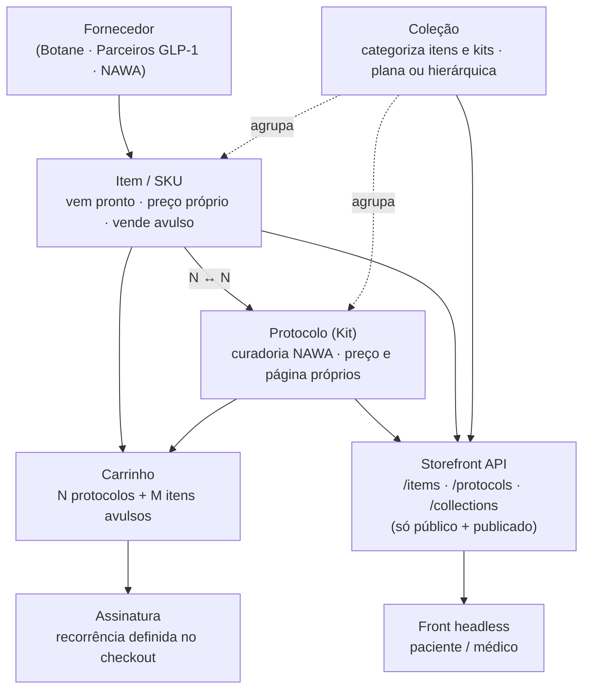

# Catálogo & Protocolos v2 — Arquitetura e Plano

> Documento de apresentação. Resume a nova arquitetura de catálogo do backoffice NAWA
> e o plano para chegar nela. Especificação técnica completa em `catalogo-protocolos-v2.md`.
> Data: 2026-07-17.

---

## 1. A virada, em uma frase

A NAWA **não formula** — ela **faz curadoria de produtos prontos** e aplica inteligência na
anamnese para montar a compra. Então o sistema deixa de ser "plataforma clínica com loja
acoplada" e passa a ser **uma gestão de ecommerce padrão, com três peculiaridades de saúde**.

Isso **simplifica**: some uma camada inteira de dados. Onde havia catálogo clínico *e*
catálogo comercial ligados por uma ponte, agora há **um só catálogo**. O produto já nasce
comercial.

---

## 2. Antes → Depois

| Antes (v1) | Depois (v2) | Efeito |
|---|---|---|
| Catálogo clínico + catálogo comercial + ponte (`commercial_products`) | **Um catálogo** de itens | Some 1 camada |
| `Fórmula` (só Botane) | `Item` / SKU (Botane, parceiros, serviços NAWA) | Cobre todos os casos |
| `Protocolo` ligado a fórmulas | **Protocolo = kit** de itens, com página própria | Vira produto comercial |
| `Plano` como catálogo | Plano vira **configuração de checkout** | Recorrência sai do catálogo |
| `Jornada` como módulo | Vira **coleção** | Some 1 módulo |
| `Atributos` + `nomenclatura` | Vira **coleção** | Some 1 módulo |
| Visibilidade acoplada a `is_glp1` | Visibilidade explícita: `public` / `medical_only` | Regra clara |

**Resultado:** menos entidades, vocabulário de ecommerce conhecido, e a evolução futura
(longevidade, hormonal) vira **cadastro**, não reescrita de código.

---

## 3. Arquitetura (diagrama)



Fallback em texto, caso a imagem precise ser desenhada à mão:

```
Fornecedor  →  Item (SKU)  ──N↔N──  Protocolo (Kit)
                   │                      │
                   └──────→ Carrinho ←────┘
                                │
                          Assinatura (recorrência no checkout)

Coleção  ─agrupa→  Itens e Kits   (plana ou em árvore)

Item / Protocolo / Coleção  →  Storefront API  →  Front headless
                               (só publicado + público)
```

---

## 4. As três peculiaridades de saúde (o que foge do ecommerce comum)

1. **Visibilidade `medical_only`.** Todo item e protocolo é `public` ou `medical_only`.
   Medicamento é sempre `medical_only`. Um kit é tão restrito quanto seu item mais restrito
   (se contém algo médico, o kit inteiro fica médico). A vitrine pública nunca vê o que é médico.

2. **Claims regulatórios.** O texto de saúde que aparece pro paciente só vai ao ar depois de
   **aprovado**. Editar o texto derruba a aprovação. É bloqueio regulatório, não metadado.

3. **Fluxo de telemedicina** *(fase futura, adiado).* Alguns protocolos só serão vendidos com
   apoio de teleconsulta/prescrição médica. É um fluxo de venda à parte — entra junto com a
   spec de checkout, não agora.

Fora dessas três, é ecommerce padrão: produtos, kits, coleções, fornecedores, preço, margem.

---

## 5. Regras de negócio que valem destacar

- **Preço do kit é dele.** Nasce da soma dos itens, mas depois **nunca recalcula sozinho** —
  kit tem desconto. Se o custo dos itens sobe e o kit envelhece, o sistema **avisa** a
  divergência, mas nunca corrige sozinho. Mostrar, não mandar.
- **Fornecedor é dono do dado dele.** Composição, dose e custo vêm do fornecedor e ficam
  **somente leitura** no backoffice — senão passam a existir duas verdades sobre o que o
  paciente toma. A NAWA é dona de preço, visibilidade e curadoria.
- **Falha fechada.** Na dúvida, item nasce `medical_only`. É melhor um produto sumir da
  vitrine e alguém reclamar do que um produto médico vazar.

---

## 6. Plano de implementação (fases)

Ordem pensada para **catálogo primeiro, checkout depois**, com cada fase entregável e testável.

**Fase 0 — Migração de dados** *(fundação, faz uma vez)*
- Criar `suppliers` (Botane, parceiro GLP-1, NAWA interno).
- Renomear `formulas → items`; `supplier` (enum) → `supplier_id` (fk).
- Criar `protocol_items` (N↔N) a partir de `formulas.protocol_id`.
- Backfill de preço: item vem de `commercial_products`; onde não houver, NAWA precifica.
- Colunas novas com default seguro (`visibility = medical_only`, `item_type` derivado de `is_glp1`).
- `plans` **mantido** e reorganizado; `commercial_products`/`journeys`/`attributes` depreciados por uma release (rollback).

**Fase 1 — Catálogo (Itens)**
- Lista e detalhe de item: fornecedor, tipo, preço, margem, visibilidade, status.
- Campos do fornecedor em leitura; preço/visibilidade editáveis pela NAWA.

**Fase 2 — Protocolos (Kits)**
- Detalhe do protocolo: seleção de itens do catálogo, quantidade, página do kit, claims com estado, preço com origem (`sum`/`manual`) e aviso de deriva.

**Fase 3 — Coleções**
- Substitui nomenclatura/atributos e absorve jornadas. Árvore ou lista; membros = itens e kits; rollup dos filhos na leitura.

**Fase 4 — Storefront API**
- `/items`, `/protocols`, `/collections` servindo só publicado + público. Testes automatizados de vazamento (`medical_only` nunca sai).

**Fase 5 — Auditoria e acabamento**
- `logAudit` em item/protocolo/preço/publish. Ajuste de dashboard e ficha do paciente para o novo modelo de linhas.

**Depois (outra spec):** checkout, recorrência (o "plano" reorganizado) e o fluxo de telemedicina.

---

## 7. O que precisa de confirmação do cliente (não trava o código, trava publicar)

1. **Quem aprova o claim público** — qualquer operador ou só médico/responsável?
2. **O que a Botane entrega** — ela manda composição completa e custo, ou só nome e preço?
   (Alinhar o formato antes de fechar o sync.)
3. **As 3 camadas do Golden Protocol** — tratar só o Core Metabolic como produto real e os
   outros dois como "combos de carrinho". Muda o discurso comercial, não o banco. OK do Silas.

---

## 8. O que fica para depois (fora deste escopo, de propósito)

- Checkout e configuração de recorrência (o antigo "plano").
- Motor de anamnese e regras de upsell (esta arquitetura entrega o catálogo que ele vai consultar).
- Fluxo de venda com telemedicina.
- Módulo de prescrição (o versionamento de protocolo já fica pronto para quando existir).
- Assinaturas serão revisitadas para fechar melhor quando o checkout existir.
